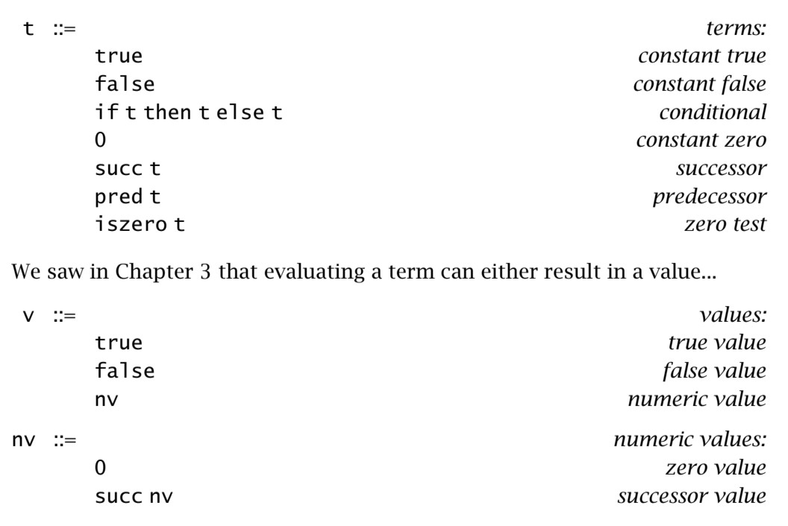
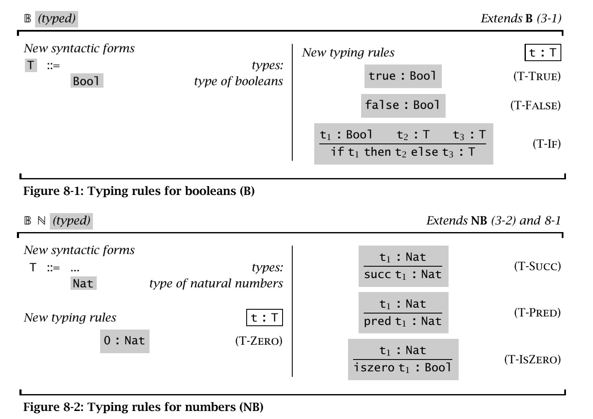
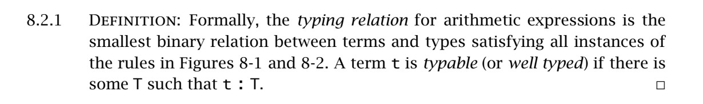
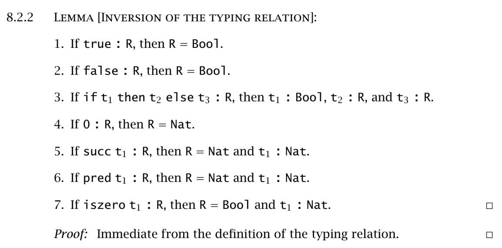
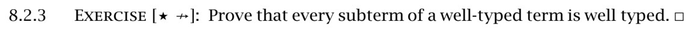
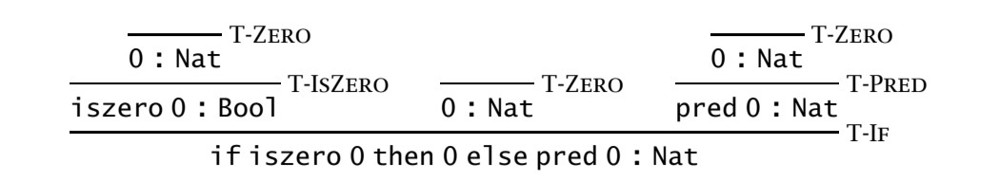
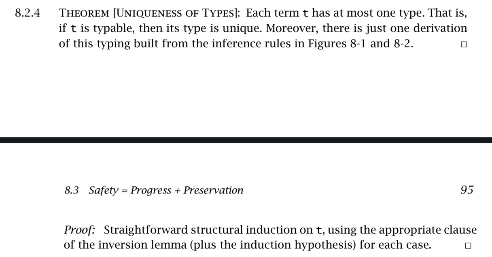
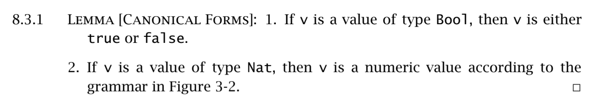
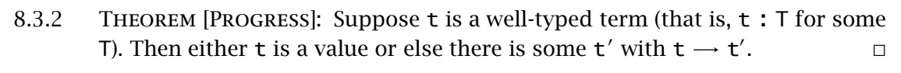
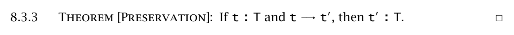

# 前言

我所阅读的书是《Types and Programming Languages》。这是关于第八章的学习笔记。 终于是进入了书本的第二部分，也就是Simple Types。

# Typed Arithmetic Expressions

## Types

还记得下面这张图的语法定义吗？



在前面几章计算的时候，通常会有2个结果，一个是计算得出值（value），而另一个则是程序被卡死（stuck）在某一部，像是计算 `pred false`的时候，造成这种情况也是因为我们找不到对应的计算规则。

为了解决每个application都能被正确计算，例如pred和iszero都应该是数字而不是其他的，这里开始引入两个类型`Nat` 和 `Bool`，而metavariables则会是`S, T, U, etc`。而这些会一直被使用，贯穿全书。

接下里开始思考这三句话:

```
"a term t has type T" 

"t belongs to T"

"t is an element of T"
```

他们都是一个意思，也就是t将会被在很显然地计算成一个正确的值的形式，也就是 $t$ 会是Nat还是Bool，而这里的`显然地计算`其实就是指可以不经过计算，静态得出结果类型。像是`if true then false else true`可以直接判断结果是Bool类型的值，而`pred (succ (pred (succ 0)))`可以直接判断结果是Nat类型。

但是同时也意味着它无法对`if (iszero 0) then 0 else false`或者`if true then 0 else false`得出结果类型，即便他们最终可以被计算出对应的值。

## The Typing Relation

因此，我们开始为之前的系统添加上类型，也就是下图的规则。



`t : T` 会被一个集合的规则所定义，也就是 $t$ 存在于一个类型集合 $T$。根据图里的规则，我们可以得出,T-TRUE和T-FALSE将会是Bool，而T-IF的$t_1$将会是Bool，并且$t_2$ $t_3$将会是同一类型$T$，而最终的计算结果也会是$T$类型的值。



8.2.1定义了项与类的最小的二元类型关系会满足前面图8-1和图8-2的实例规则。以及，如果存在某个类型 T 使得 t : T，那么 t 就是可类型化的（term t is typable (well typed) ）。

当我们要描述类型关系的时候，就会说 "If a term of form succ $t_1$ has any type at all, then it has type Nat"。



8.2.2的引理其实就是我们上面说的那一句话。这个引理有时候也叫`generation lemma`。这个引理让我们有能力通过每个分项计算出每个语法形式的最终类型结果。



有机会我再看看怎么证明好了！下次一定！但是结论就是每一个良类型定义的项的子项，也是良类型定义的。



类型推导（typing derivation）也就是上面这张图，其实是类型规则的实例，也就是一棵树。上面是“if iszero 0 then 0 else pred 0 : Nat”的类型推导树。



8.2.4 定义了每一个项（term） t，最多只有一个类型。也就意味着如果t是可类型化的，那么这个类型是唯一的。同时根据8-1和8-2，这种类型只会存在一个推导。

## Safety = Progress + Preservation

类型系统最基础的属性就是安全，`safety`，同时也被叫做`soundness`，也就是一个被良类型定义的，就不会出错。同时，根据定义3.5.15，我们定义了什么时候项会出错，也就是程序进入了被卡住的状态。

但是我们要如何展示一个被良类型定义的项不会出错呢？这时候就需要到 `progress and preservation theorems` 了。

- Progress: A well-typed term is not stuck (either it is a value or it can take a step according to the evaluation rules). 一个能被良类型化的项是不会被卡住的，它将会是一个值或者能找到对应计算规则得到下一个结果。

- Preservation: If a well-typed term takes a step of evaluation, then the resulting term is also well typed. 如果一个被良类型化的项可以进行下一步计算，那么计算后的结果也是被良类型化的。



这个规则也确定了每个类型的值必须对应其类型，例如Bool就必须是true或false。



这条规则表明，如果存在项t被良类型化了，那么t就会是一个值，或者会存在一个映射关系让$t$变成$t'$，也就是$t \rightarrow t'$。 以编程语言的角度来说，如果它不是一个变量，那就肯定是函数的参数变量。



这条和上面那条有点类似，也就是存在一个类型为T，并且存在类型为T的项t，以及一个计算关系$t \rightarrow t'$，那么就可以得出$t' : T$。但是值得注意的时候，如果存在$t \rightarrow t'$和$t': T$，我们是不一定能得出$t:T$的。 这是来自8.3.6的思考。


8.3.6: Having seen the subject reduction property, it is reasonable to wonder whether the opposite property—subject expansion—also holds. Is it always the case that, if t  → t'  and t : T, then t : T? If so, prove it. If not, give a counterexample.


```text
t->t'
t  = (λx. x) (λx. x)
t' = λx. x

t' : T->T, t' is typable.

since t is non-normalizing term, so t is not typable.

1. t : T->T  if  λx. x
2. t : (T->T)->(T->T) if (λx. x) (λx. x)
which there is an contradiction.

so even we have t->t' and t' : T, we still cannot get t : T.
```
