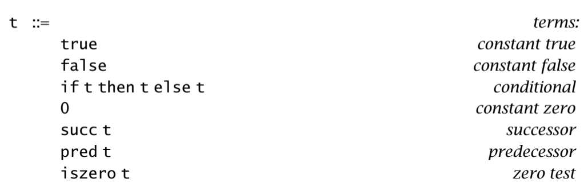
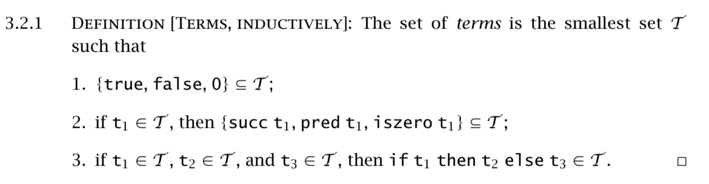
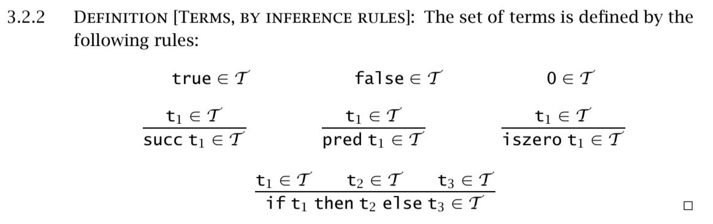

# 前言

我所阅读的书是《Types and Programming Languages》。

# Untyped Arithmetic Expressions

为了理解Untyped Arithmetic Expressions， 我们需要先定义一个语言，这个语言有一个`term`，同时他也是我们第一个`syntax`如下：



这里右手边的的$t$是metavariable，带着meta也就意味着这是并不是一个变量，而是一个会被代替的符号，在这里最终会变成终止符：true, false, 0。

如果用目前的语言去编写程序的话，就会是：
```
if false then 0 else 1;
=> 1

iszero (pred (succ 1))
=> true

//在阿拉伯数字里可以这样
succ (succ (succ 0))
=> 3
```

## Syntax 语法




第一个子句(cluster)表示的是在 \mathcal{T} 里存在3个简单的表达式(expression)，也就是true，false，0。

第二个子句在说，如果 t_1  属于 \mathcal{T}  ( t_1  is an element of  \mathcal{T} )，那么 succ \ t_1, pred \ t_2, iszero \ t_1 就是 \mathcal{T} 的子集。

第三个子句在说，如果 t_1  属于 \mathcal{T} ， t_2  属于 \mathcal{T} ， t_3  属于 \mathcal{T} ，那么 \text{if} \ t_1 \ \text{then} \ t_2 \ \text{else} \ t_3  就是 \mathcal{T} 的子集。

