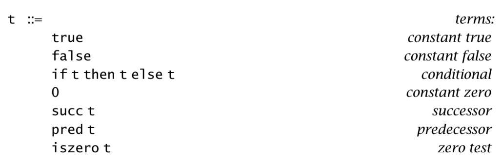
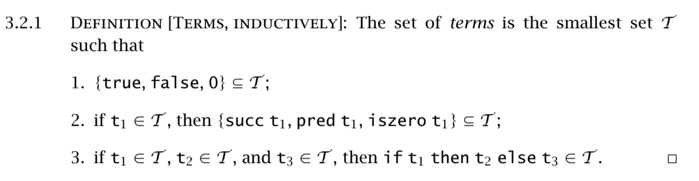
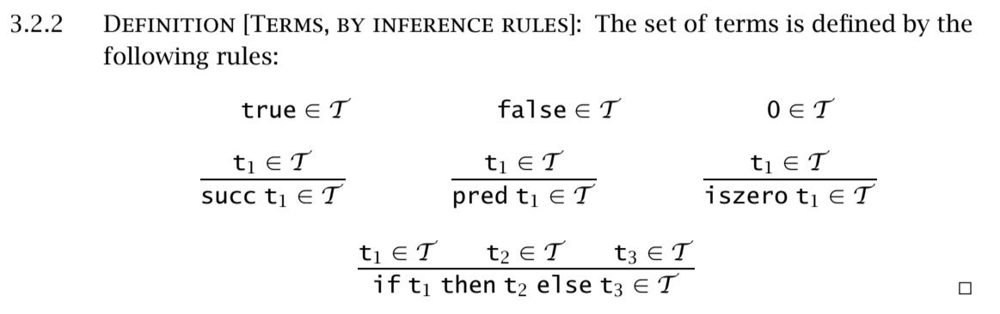
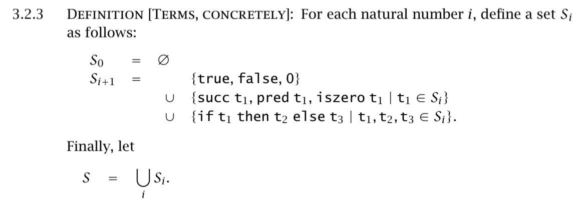
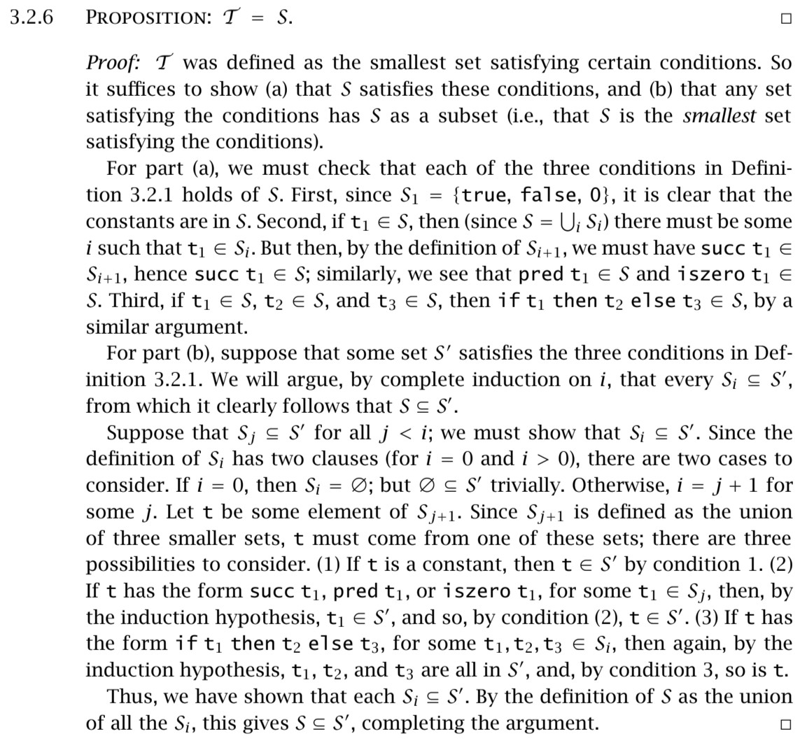
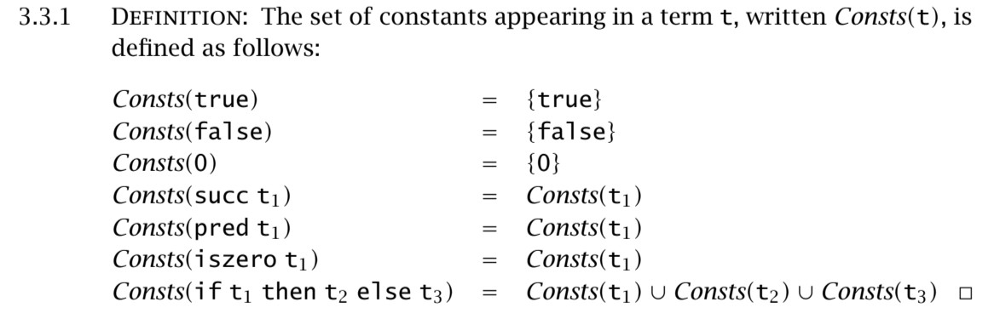
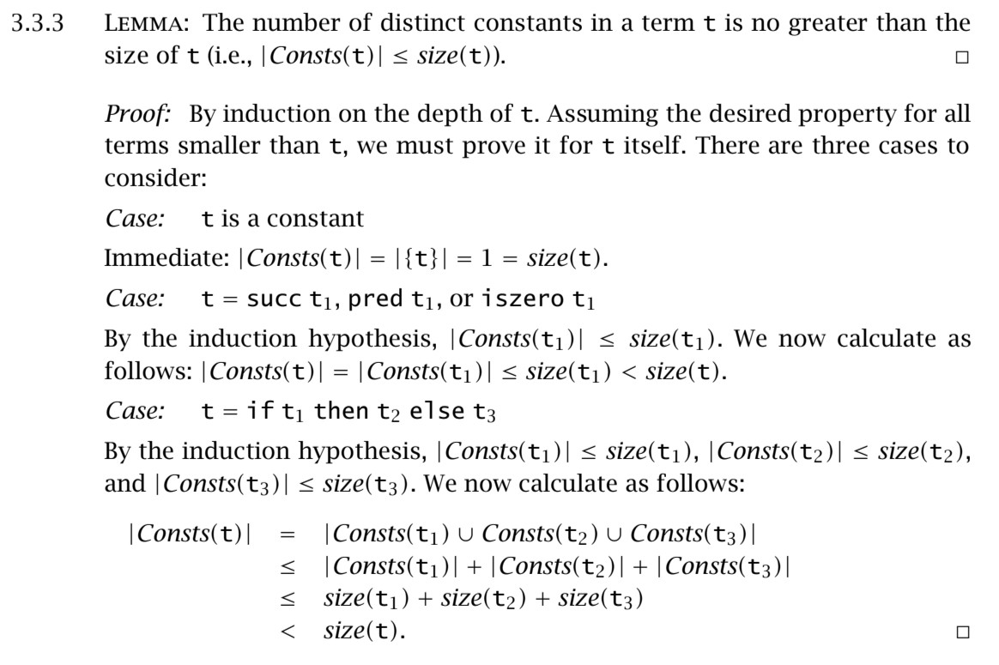
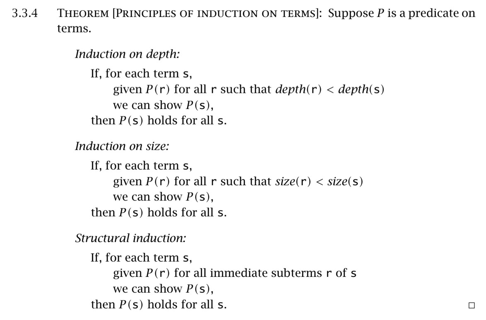
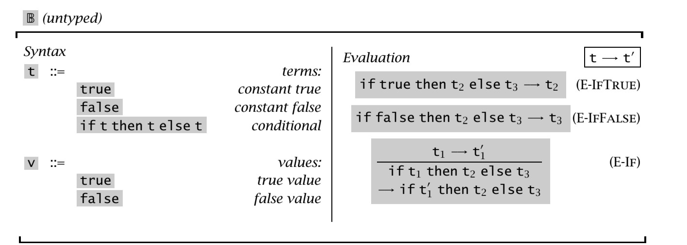

# 前言

我所阅读的书是《Types and Programming Languages》。

# Untyped Arithmetic Expressions

为了理解Untyped Arithmetic Expressions， 我们需要先定义一个语言，这个语言有一个`term`，同时他也是我们第一个`syntax`如下：



这里右手边的的t是metavariable，带着meta也就意味着这是并不是一个变量，而是一个会被代替的符号，在这里最终会变成终止符：true, false, 0。

如果用目前的语言去编写程序的话，就会是：
```
if false then 0 else 1;
=> 1

iszero (pred (succ 1))
=> true

//在阿拉伯数字里可以这样
succ (succ (succ 0))
=> 3
```

## Syntax 语法




第一个子句(cluster)表示的是在 \mathcal{T} 里有3个简单的表达式(expression)，也就是true，false，0。这三个表达式是T的子集。

第二个子句在说，如果 t_1  属于 \mathcal{T}  ( t_1  is an element of  \mathcal{T} )，那么 succ \ t_1, pred \ t_2, iszero \ t_1 就是 \mathcal{T} 的子集。

第三个子句在说，如果 t_1  属于 \mathcal{T} ， t_2  属于 \mathcal{T} ， t_3  属于 \mathcal{T} ，那么 \text{if} \ t_1 \ \text{then} \ t_2 \ \text{else} \ t_3  就是 \mathcal{T} 的子集。



这里上面三个规则重新声明了前面3.2.1的定义，也就是true属于T，false属于T，0属于0（xxx is an element of T）。

后面四条就不太一样了，他们是这么读的，"If we have established the statements in the premise(s) listed above the line, then we may derive the conclusion below the line"。同时 \mathcal{T} 也是能保证规律成立的最小集合，并且T也不会显式地标明出来。

规律(rule)在没有前提(Premises)的时候，通常被称为axioms，也就是公理。

我所阅读的书里，inference rule一词指代的是axioms以及proper rules。也就是包括公理和正确的规则。正确的规则就是存在一个或多个前提的规则，而公理则是不需要前提。



这条是生成$\mathcal{T}$的内容(elements)的规则。$S_0$是$\varnothing $，也就是没有任何东西。$S_1$包含着所有的常量。$S_2$则是包含常量以及用常量与succ, pred, iszero, if构建起来的的表达式。$S_3$则是包含$S_2$以及用$S_2$与succ, pred, iszero, if构建起来的的表达式。以此类推。$S$将会被根据以上规则通过有限的算术和条件操作构建出所有的表达式。



这一段证明主要是讲了$\mathcal{T} \iff S$。第一部分是证明$\mathcal{T}$是$S$的子集，而第二部分是证明$S$是$\mathcal{T}$的子集。具体思路还是自己看吧，我也只是大概看懂了= =

## Induction on Terms






以上三个都是会被用作证明terms的。



## Semantic Styles

这里主要是说如何定义evaluate terms。也就是前面讲的是语法，而这里讲的是语义Semantic。

这里一共有三种基础的方式：

### Operational Semantics

这一类语义在编程语言上的表现就是他的指令更多是对状态的关注。在实际的编程语言里更接近C这样的语言。好比程序就是一个状态机，每一步都由对状态进行操控的指令组成。而这个状态机是否停止也取决于是否读取到停止的命令（halt）。而这里的Operational Semantics是比我上面描述更抽象的状态机，它不以某个指令为输入，而是用terms作为输入，而这些terms则是一系列的状态转换指令，同时状态机会从最初的状态开始读取terms，直到结束状态停止。状态会在这些状态转指令数执行的时候变化

### Denotational Semantics

这种语义比上面那种更为抽象，它把terms定义成某种数学对象，像是数字或是函数。它更接近函数式编程语言。它通过定义映射函数，把一种元素映射到另一种元素，最终通过各种映射的组合，达成对某种事物的建模。

### Axiomatic Semantics

这种语义比较特别，它是直接把一堆公理和定律定义为语言，而这里的terms则是基于这些公理和定律推导出来的元素。这种语义更加注重于推理的过程，也给了编程语言很多像是不变量（invariant）这种重要的概念。


