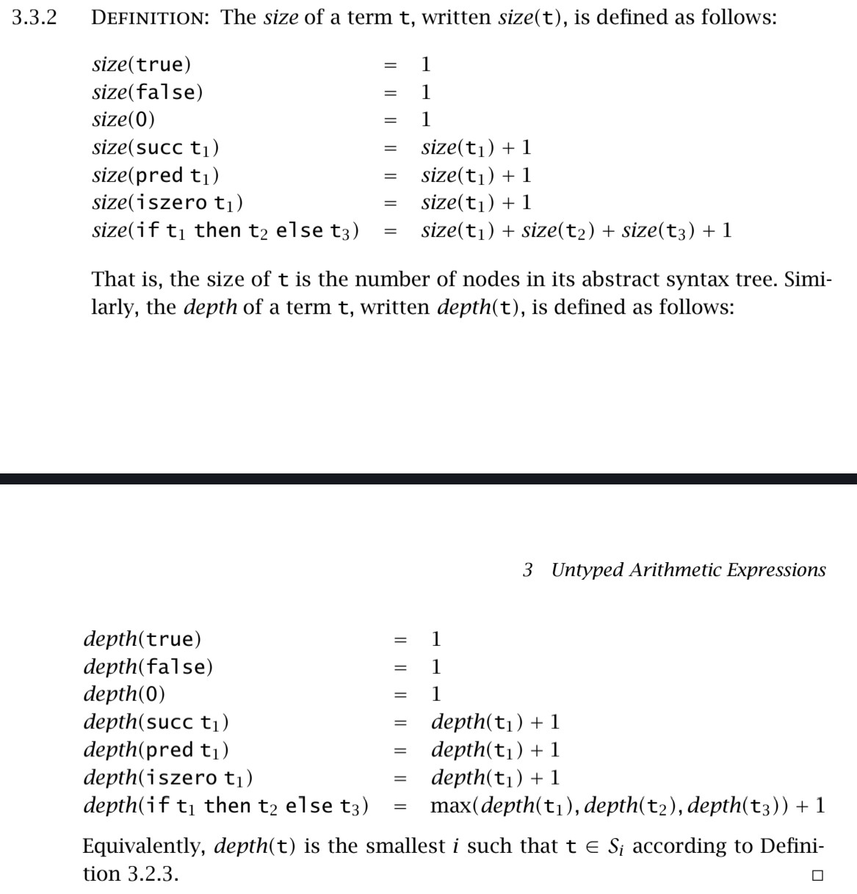

# 前言

我所阅读的书是《Types and Programming Languages》。

# Untyped Arithmetic Expressions

为了理解Untyped Arithmetic Expressions， 我们需要先定义一个语言，这个语言有一个`term`，同时他也是我们第一个`syntax`如下：


这里右手边的的t是metavariable，带着meta也就意味着这是并不是一个变量，而是一个会被代替的符号，在这里最终会变成终止符：true, false, 0。

如果用目前的语言去编写程序的话，就会是：
```
if false then 0 else 1;
=> 1

iszero (pred (succ 1))
=> true

//在阿拉伯数字里可以这样
succ (succ (succ 0))
=> 3
```

## Syntax 语法


第一个子句(cluster)表示的是在 \mathcal{T} 里有3个简单的表达式(expression)，也就是true，false，0。这三个表达式是T的子集。

第二个子句在说，如果 t_1  属于 \mathcal{T}  ( t_1  is an element of  \mathcal{T} )，那么 succ \ t_1, pred \ t_2, iszero \ t_1 就是 \mathcal{T} 的子集。

第三个子句在说，如果 t_1  属于 \mathcal{T} ， t_2  属于 \mathcal{T} ， t_3  属于 \mathcal{T} ，那么 \text{if} \ t_1 \ \text{then} \ t_2 \ \text{else} \ t_3  就是 \mathcal{T} 的子集。


这里上面三个规则重新声明了前面3.2.1的定义，也就是true属于T，false属于T，0属于0（xxx is an element of T）。

后面四条就不太一样了，他们是这么读的，"If we have established the statements in the premise(s) listed above the line, then we may derive the conclusion below the line"。同时 \mathcal{T} 也是能保证规律成立的最小集合，并且T也不会显式地标明出来。

规律(rule)在没有前提(Premises)的时候，通常被称为axioms，也就是公理。

我所阅读的书里，inference rule一词指代的是axioms以及proper rules。也就是包括公理和正确的规则。正确的规则就是存在一个或多个前提的规则，而公理则是不需要前提。


这条是生成$\mathcal{T}$的内容(elements)的规则。$S_0$是$\varnothing $，也就是没有任何东西。$S_1$包含着所有的常量。$S_2$则是包含常量以及用常量与succ, pred, iszero, if构建起来的的表达式。$S_3$则是包含$S_2$以及用$S_2$与succ, pred, iszero, if构建起来的的表达式。以此类推。$S$将会被根据以上规则通过有限的算术和条件操作构建出所有的表达式。


这一段证明主要是讲了$\mathcal{T} \iff S$。第一部分是证明$\mathcal{T}$是$S$的子集，而第二部分是证明$S$是$\mathcal{T}$的子集。具体思路还是自己看吧，我也只是大概看懂了= =

## Induction on Terms





以上三个都是会被用作证明terms的。


## Semantic Styles

这里主要是说如何定义evaluate terms。也就是前面讲的是语法，而这里讲的是语义Semantic。

这里一共有三种基础的方式：

### Operational Semantics

这一类语义在编程语言上的表现就是他的指令更多是对状态的关注。在实际的编程语言里更接近C这样的语言。好比程序就是一个状态机，每一步都由对状态进行操控的指令组成。而这个状态机是否停止也取决于是否读取到停止的命令（halt）。而这里的Operational Semantics是比我上面描述更抽象的状态机，它不以某个指令为输入，而是用terms作为输入，而这些terms则是一系列的状态转换指令，同时状态机会从最初的状态开始读取terms，直到结束状态停止。状态会在这些状态转指令数执行的时候变化

### Denotational Semantics

这种语义比上面那种更为抽象，它把terms定义成某种数学对象，像是数字或是函数。它通过定义映射函数，把一种元素映射到另一种元素，最终通过各种映射的组合，达成对某种事物的建模。

例如说我定义了$s = <i_1, v_1>, <i_2, v_2>, ..., <i_n, v_n>$，然后定义了一个函数$F(i_j, s) = v_j$，那么我就可以写$F(i_1) = v_1$。那也就是说，如果我再定义一个变量用来表达Expression以及函数表达对应的映射值，那我就可以通过这些对象对某种事物进行建模。

### Axiomatic Semantics

这种语义比较特别，它是直接把一堆公理和定律定义为语言，而这里的terms则是基于这些公理和定律推导出来的元素。这种语义更加注重于推理的过程，也给了编程语言很多像是不变量（invariant）这种重要的概念。我们可以把Axiomatic Semantics想象成平时写的证明，例如$p \to q$。

## Evaluation

首先介绍一下Operational Semantics，为了方便解释，现在只会用Boolean expression作为例子，例如下图


左边的是定义了两组表达式的语法，上面的是terms的syntax的定义，而下面的是terms的子集，也叫`values`，并且会是evaluation后的最终结果。也就是结果只能是true或者false。而v就是metavariable，最终会被替代成true和false。

右边定义了`evaluation relation`，有些地方会叫`reduction`。他的写法就是$t \rightarrow t'$，读作“$t$ evaluates to $t'$ in one step.”。理解起来就是，当$t$成立的时候，$t'$就会成立。也就是在一个抽象的状态机里，存在状态$t$，那么就有办法通过计算，把状态变成$t'$。

1. 在E-IFTRUE的规则里，如果被evaluated的term是个条件判断，并且条件是true的，那么就下一个状态永远是$t_2$。

2. 在E-IFFALSE的规则里，如果被evaluated的term是个条件判断，并且条件是false的，那么就下一个状态永远是$t_3$。

3. 在E-IF的规则里，如果被evaluated的term是个条件判断，并且条件是$t_1$还能被计算（evaluate）成$t_1'$，那么就能从状态 if $t_1$ then $t_2$ else $t_3$，转移到状态 if $t_1'$ then $t_2$ else $t_3$。 

    第三条规则很特殊，它表明了，在计算$t_2$和$t_3$之前，必须先对$t_1$进行计算，得出了$t_1'$，才可以对$t_2$和$t_3$进行求值计算。$t_1$是求值前，$t_1'$是求值后。
    
    举个例子，$t_1$是个函数is_num(xxx)，那么$t_1'$就是True或者False，也就是函数is_num(xxx)的返回值。
    
    再举一个例子$t_1$里有包含了一个 if 判断，那么$t_1'$就会是这个 if 判断的最终计算结果， 有可是是另一个 if 判断，也可能是 True 或者 False。

    那也就说明，如果$t_1$无法得到$t_1'$，把$t_1$代入到conditional term里的$t_1$，$t_2$和$t_3$就永远无法被计算，程序也就被卡死。


这里讲的就是，每一条 if 计算里，都是通过不断根据规则（rule）替换 metavariable 成对应的存在于集合里的结果。


3.5.2 定义了，每一个rule的实例（instance）的结论如果不是已经存在于前提（premises），那就是存在于关系（relation）之中。

这里的关系（relation），指的就是整个系统的外部“已知事实”集合。例如存在一个集合$F$里面，只要存在$\alpha$，那对应的就存在$\beta$，缺一不可。$\alpha \rightarrow \beta$。

前提（premises）是指一条规则中的前置条件，也就是横线上的东西，例如$t_1 \rightarrow t_1'$。这是能被公理推导出来的，注意公理是系统的规则。

3.5.3 定义了 `one-step evaluation`这个关系是最小的二元关系，并且满足了前面对if定义的三条关系（E-IFTRUE， E-IFFALSE，E-IF）。当有一组$(t, t')$是 evaluation relation，我们就会这么说 "the evaluation statement (or judgment) $t \rightarrow t'$ is derivable"。也就是说，如果 $(t, t')$ 是 evaluation relation， 那么 $t \rightarrow t'$ 就是可以被推导的。